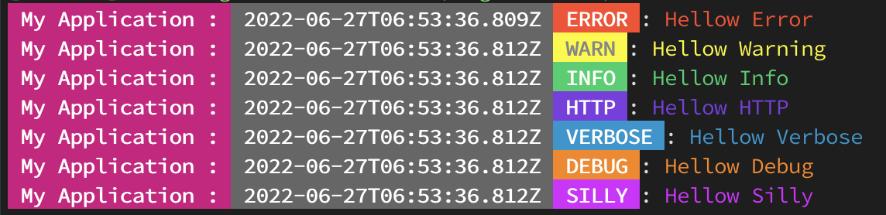

# Color Logger
Custom Nodejs Logger using winston



## Install
```bash
# Using yarn
yarn add @zulfikar4568/color-logger

# Using npm
npm install @zulfikar4568/color-logger
```

### Example
Logging
```ts
import { awesomeLogger } from "@zulfikar4568/color-logger";

const logger = awesomeLogger('My Application :','silly', true, 'logs/','my-app-log', 'error', true, true, true, true)

logger.error('Hellow Error')
logger.warn('Hellow Warning')
logger.info('Hellow Info')
logger.http('Hellow HTTP')
logger.verbose('Hellow Verbose')
logger.debug('Hellow Debug')
logger.silly('Hellow Silly')

for(let i = 0; i < 100000; i++) {
  logger.info('Hellow Info')
}
```

Handle Rejections
```ts
import { awesomeLogger } from "./utils/logger";

const logger = awesomeLogger('My Application :','silly', true, 'my-app-log', 'error', true, true, true, true)

Promise.reject('Rejected! ')
```

Handle Exceptions
```ts
import { awesomeLogger } from "./utils/logger";

const logger = awesomeLogger('My Application :','silly', true, 'my-app-log', 'error', true, true, true, true)

throw new Error('Error sue')
```

Author: [M Zulfikar Isnaen](https://github.com/zulfikar4568/)